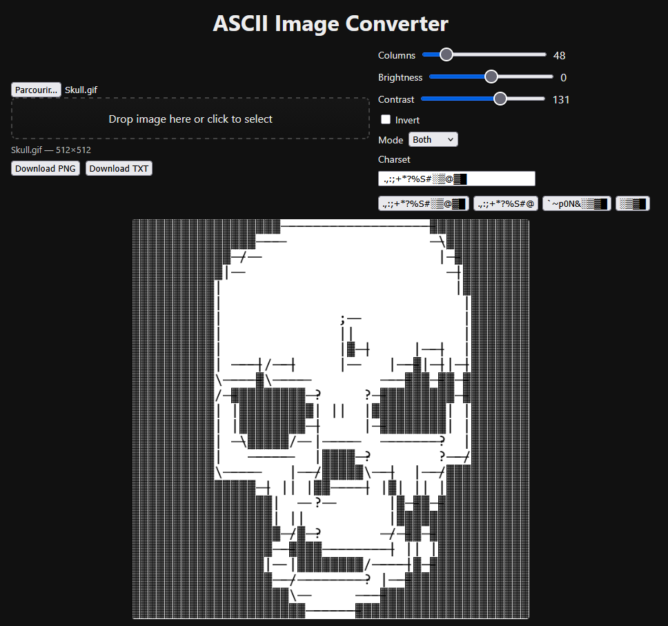
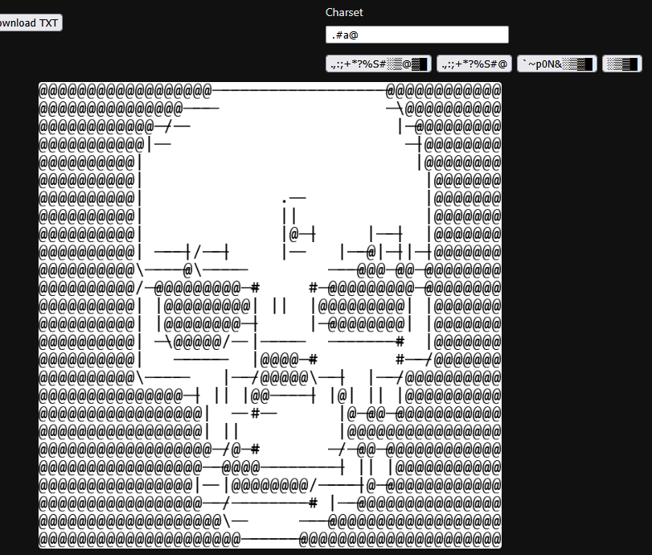

# 🖼️ ASCII-Converter

A lightweight web tool that transforms images into ASCII art with optional outline detection for sharper, more stylized results.

## ✨ Features

- 🔡 Pixel-to-ASCII Conversion — Maps image luminosity to custom ASCII characters
- 🎚️ Adjustable Parameters — Tune brightness, contrast, and density
- ✏️ Outline Detection — Detect and draw edges for cleaner, more defined ASCII output
- ⚡ Browser-Based — No installation required; runs entirely in the browser

## 🚀 Getting Started

1. Clone the repository:
   
   ```bash
   git clone https://github.com/yourusername/ASCII-Converter.git
   ```

2. Open `index.html` in your browser.
   
   That’s it — the converter runs locally.

## 🧱 Project Structure

```
ASCII-Converter/
├── images/                    # Images used in the README
├── favicon.ico                # Application icon
├── index.html                 # Main app (HTML, CSS, JS)
└── README.md
```

## 📸 Preview

| Basic Image → ASCII                                             | ASCII With Outline Detection                                         | Custom Character Set                                            |
| --------------------------------------------------------------- | -------------------------------------------------------------------- | --------------------------------------------------------------- |
|  |  |  |
